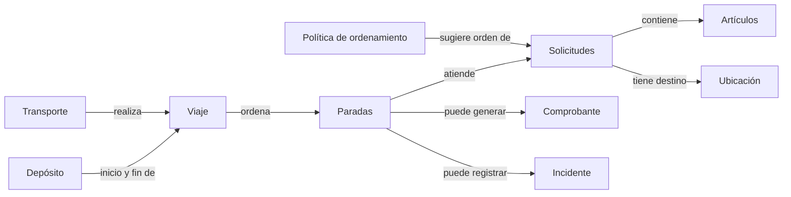
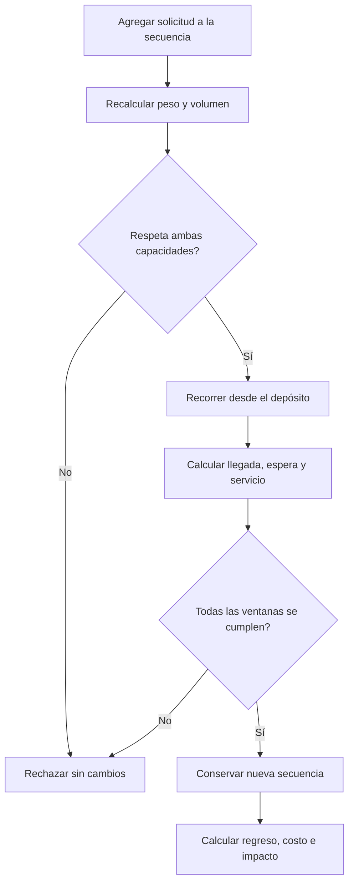

# Trabajo Práctico: Planificación de Entregas Urbanas

## Situación Hipotética

**Logística Inteligente S.A. (LISASA)** distribuye paquetería desde un depósito urbano con motocicletas, furgonetas y camiones. Hoy arma viajes en planillas: algunas cargas exceden peso o volumen, las nuevas paradas vuelven incumplibles ventanas ya comprometidas y los incidentes no quedan vinculados con la entrega afectada.

La empresa solicita un prototipo para construir y ejecutar viajes factibles sobre una matriz de distancias conocida. El sistema valida una secuencia propuesta y calcula sus resultados; no busca la ruta óptima ni asigna solicitudes automáticamente.

### Objetivo del sistema

El prototipo deberá permitir:

- registrar ubicaciones, solicitudes y transportes;
- agregar solicitudes a una secuencia de viaje y revalidar toda la ruta;
- controlar peso, volumen y ventanas horarias;
- calcular horarios, distancia, costo e impacto ambiental estimado;
- iniciar un viaje y registrar entregas o intentos fallidos;
- emitir comprobantes y conservar incidentes trazables;
- sugerir un orden de solicitudes mediante una política consultiva sin modificar el viaje.

### Modelo operativo simplificado

Cada viaje ocurre en una fecha, sale de un único depósito y regresa a él. Se proporciona una matriz dirigida de distancias en kilómetros entre todas las ubicaciones utilizadas. La velocidad media es constante por tipo de transporte y cada parada insume `10 minutos` de servicio. El tiempo de recorrido de un tramo es `distancia / velocidad`; no se modelan tránsito, descanso ni carga inicial.

### Alcance y vocabulario del dominio

| Concepto | Representa | Es responsable de | No es responsable de |
| --- | --- | --- | --- |
| Transporte | Un vehículo disponible | Identidad, capacidades, velocidad, costos y factor ambiental | Elegir solicitudes automáticamente |
| Solicitud | Una entrega indivisible | Artículos, destino y ventana horaria | Definir su posición en el viaje |
| Artículo | Una unidad de carga | Peso y volumen | Conocer el transporte asignado |
| Ubicación | Un punto de la matriz | Identidad y descripción | Calcular rutas por sí sola |
| Viaje | Una secuencia planificada para una fecha | Transporte, depósito, solicitudes, horarios y estado | Optimizar el orden de las paradas |
| Parada | La visita a una solicitud | Orden, llegada prevista y resultado | Reutilizarse en otro viaje |
| Comprobante | La evidencia de una entrega | Solicitud, fecha real y receptor | Existir para un intento fallido |
| Incidente | Un problema durante el viaje | Tipo, fecha, descripción y entidad afectada | Cambiar por sí solo la planificación |
| Política de ordenamiento | Una estrategia para sugerir un orden de solicitudes | Recibir una secuencia candidata y devolver un orden sugerido | Modificar el viaje ni confirmar asignaciones |



El mapa no prescribe clases ni una estructura de colecciones.

### Cálculo de un itinerario

La llegada a la primera parada se obtiene desde la hora de salida. Si se llega antes del inicio de su ventana, el transporte espera y comienza el servicio al inicio. Si se llega luego del fin, la secuencia es inviable. Las paradas siguientes parten de la finalización del servicio anterior. La vuelta al depósito suma distancia y tiempo, pero no está sujeta a una ventana.



### Ejemplo de aceptación

Una furgoneta admite `500 kg` y `8 m³`, viaja a `30 km/h`, cuesta `$2` por kilómetro y `$5` por parada, y tiene un factor ambiental de `0,27 kg CO₂/km`. Sale a las `09:00`. La solicitud `S1` pesa `100 kg`, ocupa `2 m³`, está a `15 km` del depósito y tiene ventana `09:20–10:00`. `S2` pesa `150 kg`, ocupa `3 m³`, está a `10 km` de `S1`, tiene ventana `10:00–11:00`, y su destino queda a `20 km` del depósito.

La llegada a `S1` es `09:30`; termina a `09:40`. La llegada a `S2` es `10:00`; termina a `10:10`. La carga total es `250 kg` y `5 m³`, y la distancia completa es `15 + 10 + 20 = 45 km`. El costo es `45 * 2 + 2 * 5 = $100`. El impacto estimado es `45 * 0,27 = 12,15 kg CO₂`. La secuencia es factible. Si la ventana de `S2` terminara a `09:55`, agregarla se rechazaría y el viaje conservaría únicamente `S1`.

Una política de vecino más cercano consultada antes de armar el viaje devolvería `[S1, S2]` como orden sugerido dado que `S1` está más cerca del depósito; esa sugerencia no crea ni modifica ningún viaje.

### Fuera de alcance

No se requiere interfaz gráfica, persistencia, GPS, tránsito real, geocodificación, múltiples depósitos por viaje, recolecciones, división de solicitudes, asignación automática de flota, combustible ni facturación. La política de ordenamiento sugiere pero no confirma: la decisión final siempre corresponde al operador.

## Requerimientos Técnicos Obligatorios

- Implementar la solución con Programación Orientada a Objetos y separar el punto de entrada de la lógica del dominio.
- Identificar y justificar una jerarquía de herencia que represente una especialización válida entre tipos de transporte, con variación polimórfica real en el cálculo de impacto ambiental.
- Aplicar polimorfismo en al menos un comportamiento adicional: las políticas de ordenamiento deben ser intercambiables sin modificar el núcleo del sistema.
- Encapsular secuencia, carga y estados; no se podrán agregar paradas ni completar entregas modificando atributos directamente.
- Implementar el recorrido secuencial y sus acumulaciones con estructuras nativas, sin librerías de ruteo u optimización.
- Definir excepciones propias para datos inválidos, capacidad excedida, ruta incompleta, ventana incumplida y transición ilegal.
- Utilizar `date`, `time`, `datetime` y `timedelta` de la biblioteca estándar con una convención numérica consistente.
- Escribir pruebas unitarias con `pytest` para cálculos, límites, atomicidad, estados y trazabilidad.

## Reglas de Negocio

1. **Identidad y magnitudes:** Los identificadores de transportes, solicitudes, ubicaciones y viajes son únicos dentro de su categoría y no vacíos. Peso, volumen, velocidad, costo por kilómetro y factor ambiental son positivos; el costo por parada es no negativo.

2. **Solicitudes válidas:** Una solicitud contiene al menos un artículo, un destino distinto del depósito y una ventana con inicio anterior o igual al fin. Su peso y volumen son las sumas de sus artículos y no pueden modificarse luego de incorporarla a un viaje.

3. **Matriz completa:** Cada tramo utilizado debe tener una distancia no negativa definida en el sentido recorrido. La distancia entre una ubicación y sí misma es cero. Si falta un tramo, el cálculo se rechaza sin modificar el viaje.

4. **Carga indivisible:** La suma de peso y la suma de volumen de todas las solicitudes no pueden superar las capacidades inclusivas del transporte. Deben cumplirse ambos límites; una solicitud no se divide entre viajes.

5. **Solicitud única:** Una solicitud puede pertenecer como máximo a un viaje `PLANIFICADO` o `EN_CURSO`. Dentro de un viaje aparece una sola vez. Una solicitud entregada no puede volver a planificarse.

6. **Horario secuencial:** Cada tramo demora `distancia / velocidad`. Al llegar antes de una ventana se espera; llegar exactamente al fin es válido. Cada servicio dura `10 minutos` y la siguiente salida ocurre al finalizarlo.

7. **Revalidación atómica:** Al agregar, quitar o reordenar una solicitud en un viaje planificado, se recalculan desde el depósito la carga y todas las ventanas. Si cualquier regla falla, la secuencia, horarios y resultados anteriores permanecen intactos.

8. **Distancia y costo:** La distancia total incluye salida, tramos entre paradas y regreso al depósito. El costo es `distancia_total * costo_por_km + cantidad_de_paradas * costo_por_parada`; las esperas no agregan costo en este prototipo.

9. **Impacto ambiental:** Cada tipo de transporte calcula su estimación mediante un comportamiento propio que, como mínimo, depende de la distancia total y su factor ambiental. La unidad elegida debe declararse, el cálculo varía según el tipo de vehículo y no cambia el estado del viaje.

10. **Estados del viaje:** Un viaje nace `PLANIFICADO`, puede pasar a `EN_CURSO` y luego a `FINALIZADO`. Solo se inicia si tiene al menos una parada y su itinerario sigue siendo factible. La secuencia no puede modificarse después de iniciar.

11. **Resultado de una parada:** En un viaje en curso, cada parada pendiente termina una sola vez como `ENTREGADA` o `FALLIDA`, respetando el orden planificado. Una entrega genera exactamente un comprobante con solicitud, fecha y hora reales, y receptor no vacío; una fallida exige al menos un incidente y no genera comprobante.

12. **Incidentes y finalización:** Un incidente tiene tipo `DAÑO`, `AUSENTE` o `RETRASO`, descripción no vacía, instante y referencia a una solicitud o al transporte del viaje. El viaje solo finaliza cuando todas sus paradas tienen resultado; las consultas de costo, impacto e incidentes no alteran estados.

13. **Política de ordenamiento:** Una política recibe un depósito, una lista de solicitudes y la matriz de distancias, y devuelve un orden sugerido sin modificar ningún viaje ni reservar recursos. El sistema debe soportar al menos dos políticas intercambiables; la política no garantiza factibilidad de ventanas ni capacidad.

### Pruebas mínimas esperadas

- identificadores duplicados, magnitudes inválidas y ventanas límite;
- exceso solo de peso, solo de volumen y valores exactamente en capacidad;
- tramo faltante y matriz dirigida;
- llegada antes del inicio, exactamente al fin y un minuto tarde;
- agregado o reordenamiento inviable sin cambios parciales;
- distancia de ida, tramos y regreso; costo con varias paradas;
- impacto ambiental de dos tipos de transporte distintos con el mismo recorrido;
- doble asignación de una solicitud;
- inicio vacío y modificación luego de iniciar;
- orden de resultados, comprobante único e intento fallido;
- dos políticas de ordenamiento aplicadas a la misma lista producen resultados distintos sin alterar el estado;
- consultas sin efectos secundarios.

### Decisiones de diseño que deberán resolver

- ¿Qué objeto recorre la secuencia y conserva juntos horarios y distancias coherentes?
- ¿Cómo se representa una propuesta de cambio para validarla antes de reemplazar el itinerario?
- ¿Los totales de carga se almacenan o se calculan? ¿Cómo se evita su desactualización?
- ¿Cómo varía el impacto ambiental sin preguntar explícitamente el tipo de transporte?
- ¿Dónde se controlan el orden y los estados de las paradas?
- ¿Cómo se distingue un cálculo consultivo de una transición operativa?
- ¿Qué interfaz deben cumplir las políticas de ordenamiento para ser intercambiables sin modificar el viaje?

No existe un diagrama de clases oficial. Se evaluarán invariantes, responsabilidades, bajo acoplamiento y pruebas que expliquen el ejemplo.

### Evolución durante el semestre

1. **Catálogo logístico:** transportes con tipos especializados y cálculo ambiental polimórfico, ubicaciones, solicitudes, artículos y validaciones locales.
2. **Itinerario:** matriz, recorrido temporal, ventanas, capacidad y cambios atómicos.
3. **Operación:** estados, entregas, fallos, comprobantes e incidentes.
4. **Optimización consultiva:** al menos dos políticas de ordenamiento intercambiables —por ejemplo vecino más cercano y menor ventana primero— como objetos separados que sugieren un orden y permiten comparar el costo estimado de dos secuencias alternativas sin modificar ningún viaje.
5. **Cambio controlado:** la cátedra elegirá una extensión —por ejemplo tiempos de servicio variables según el peso de la carga, recolecciones o cancelación de un viaje en curso— para evaluar la adaptabilidad del modelo.

Cada incremento deberá conservar las pruebas anteriores y actualizar brevemente el diagrama y las decisiones afectadas.

## Notas

- Se prohíbe `pandas` y cualquier librería de optimización o ruteo; se evaluarán recorridos y acumulaciones implementados por ustedes.
- Antes de codificar, presenten un diagrama de responsabilidades y relaciones. Los mapas del enunciado no prescriben clases.
- Cada implementación deberá estar sustentada y las reglas críticas demostradas mediante pruebas automatizadas.
- Se permite la biblioteca estándar de Python; las distancias y ubicaciones son datos locales, no servicios externos.

---

# Implementación

## Estructura del proyecto

El dominio está en el paquete `modelado/`, con un módulo por clase, y el punto de entrada (`main.py`) queda afuera, separando la lógica de negocio de la ejecución. Las pruebas están en `tests/`, con un archivo por clase. El detalle archivo por archivo está en [`ESTRUCTURA.md`](ESTRUCTURA.md).

`modelado/__init__.py` reexporta todas las clases públicas, así que el resto del código importa en forma corta:

```python
from modelado import Viaje, Empresa, Furgoneta, EstadoViaje, DatosInvalidos
```

Las dependencias entre módulos van en una sola dirección (`empresa → viaje → itinerario → parada`), lo que evita importaciones circulares. Las clases de datos (`Solicitud`, `Articulo`, `Ubicacion`) no importan a las clases que las administran.

## Excepciones propias

Todas descienden de una raíz común, de modo que un único `except ErrorLogistica` captura cualquier error de negocio sin enumerarlos.

| Excepción | Representa |
| --- | --- |
| `ErrorLogistica` | Raíz de la jerarquía; no se lanza directamente. |
| `DatosInvalidos` | Identificador vacío o duplicado, magnitud fuera de rango, tipo incorrecto, solicitud ya asignada (RN1, RN2, RN5, RN11, RN12). |
| `CapacidadExcedida` | La carga acumulada supera el peso o el volumen del transporte (RN4). |
| `RutaIncompleta` | Falta un tramo en la matriz para el sentido recorrido (RN3). |
| `VentanaIncumplida` | La llegada a una parada supera el fin de su ventana (RN6). |
| `TransicionIlegal` | Operación no permitida en el estado actual del viaje o de la parada (RN10, RN11). |

## Encapsulamiento

Todos los atributos se guardan con guion bajo (`self._id`, `self._peso`) y se exponen mediante `@property` de solo lectura, sin setters. Las invariantes se validan una sola vez en el `__init__` y no pueden violarse después.

Las colecciones internas se devuelven siempre como copia (`list(self._paradas)`): quien recibe la lista puede modificarla sin afectar al objeto. `Solicitud` además copia la lista de artículos al recibirla, así que si quien la construyó modifica su lista original, la solicitud no se entera. Con esto se cumple que no se puedan agregar paradas ni completar entregas modificando atributos directamente.

El único cambio de estado permitido desde afuera ocurre a través de métodos que validan primero: `agregar_solicitud`, `quitar_solicitud`, `reordenar`, `iniciar`, `finalizar`, `registrar_entrega`, `registrar_fallo`. `Parada.actualizar_orden()` es la única vía para renumerar una parada, y solo la usa `Itinerario`.

## Criterio de variación del impacto ambiental

Cada subtipo de `Transporte` implementa `calcular_impacto(km, carga_kg)` con una fórmula distinta. El contrato recibe siempre la carga y cada subtipo decide si la usa o la ignora: así la llamada es idéntica para los tres y quien la invoca nunca pregunta de qué tipo es el transporte. La unidad declarada es **kg de CO₂** (RN9).

- **Furgoneta** — fórmula lineal pura: `km * factor_ambiental`. Ignora la carga. Es el caso base y el que usa el ejemplo de aceptación (`45 km * 0.27 = 12.15 kg CO₂`), así que sirve como ancla para validar el resto.

- **Motocicleta** — `PISO_ARRANQUE_FRIO + km * factor_ambiental`. Ignora la carga.
  Un motor recién arrancado todavía no llegó a su temperatura de trabajo ideal, así que consume y contamina más en los primeros metros. En un recorrido largo ese arranque es insignificante, pero las motos hacen lo contrario: entregas urbanas de última milla, con trayectos cortos y paradas constantes. Ahí el costo del arranque pesa mucho en relación al resto del viaje. Por eso la fórmula no es puramente lineal: suma un valor fijo (`PISO_ARRANQUE_FRIO = 0.5`, atributo de clase) presente siempre, sin importar la distancia. En un trayecto corto ese piso es una fracción importante del total; en uno largo se vuelve despreciable frente al término lineal.

- **Camión** — `km * factor_ambiental * (1 + carga_kg / capacidad_peso)`. Usa la carga. Un camión cargado consume y contamina más que uno vacío recorriendo la misma distancia; el factor crece según qué porcentaje de su capacidad va transportando.

Las tres comparten la base lineal exigida por la regla 9, pero cada una agrega (o no) un término distinto según la variable física relevante para ese vehículo. Es lo que hace que la jerarquía se sostenga como especialización real y no como tres clases con el mismo comportamiento.

`Itinerario.impacto()` invoca `self._transporte.calcular_impacto(distancia_total, carga_peso())` sin preguntar el tipo: el polimorfismo lo resuelve Python en tiempo de ejecución. Los métodos comunes a los tres vehículos (`tiempo_de_tramo`, `admite_carga`, `calcular_costo`) se implementan una sola vez en `Transporte` y se heredan.

## Criterio de variación entre políticas de ordenamiento

`PoliticaDeOrdenamiento` es una clase abstracta (`ABC`) que define el contrato `sugerir_orden(deposito, solicitudes, matriz)`. A diferencia de `Transporte`, el padre no comparte código: solo impone la firma, lo que la convierte en una interfaz. Cualquier política concreta lo implementa a su manera, y por eso son intercambiables sin tocar el núcleo (regla 13).

- **VecinoMasCercano** — prioriza distancia. Empieza por la solicitud más cercana al depósito y sigue eligiendo, en cada paso, la más cercana a la última visitada. Minimiza kilómetros ignorando las ventanas horarias.

- **MenorVentanaPrimero** — prioriza urgencia. Ordena las solicitudes por el fin de su ventana horaria, atendiendo primero las que cierran antes. Ignora la distancia y la matriz, pero respeta la firma del contrato.

Ninguna de las dos modifica la lista recibida (vecino más cercano trabaja sobre una copia y `sorted` devuelve una lista nueva), ni marca solicitudes como asignadas, ni toca ningún viaje. Con una solicitud cercana pero de ventana laxa y otra lejana pero urgente, las dos producen órdenes opuestos sobre la misma lista.

`Empresa.consultar_politica(politica, solicitudes)` recibe cualquier política y la usa sin saber cuál es.

## Uso de diccionarios

**Registros de `Empresa` indexados por identificador.** La flota, las solicitudes y los viajes se guardan como `{id: objeto}`:

```python
self._flota = {}         # {transporte_id: Transporte}
self._viajes = {}        # {viaje_id: Viaje}
self._solicitudes = {}   # {solicitud_id: Solicitud}
```

Esto resuelve dos cosas que pide la regla 1:

- **Unicidad.** Toda operación de registro verifica primero `if id in registro` y, si ya existe, lanza `DatosInvalidos`. Un diccionario no admite dos claves iguales, así que la unicidad queda sostenida por la propia estructura.
- **Consulta directa por id.** `buscar_solicitud(id)`, `buscar_transporte(id)` y `buscar_viaje(id)` indexan el diccionario en lugar de recorrer una lista.

Las properties `flota`, `solicitudes` y `viajes` devuelven `list(registro.values())`: el resto del sistema sigue viendo listas y no depende de cómo están guardadas internamente.

**Matriz de distancias.** `MatrizDistancias` guarda `{(origen, destino): km}`. La clave es una tupla de dos ubicaciones, lo que representa naturalmente una matriz dirigida: `(A, B)` y `(B, A)` son claves distintas. Por eso `Ubicacion` define `__eq__` y `__hash__` por id: dos ubicaciones con el mismo id producen la misma clave.

**Reordenamiento.** `Itinerario.reordenar()` compara las solicitudes actuales y las propuestas como conjuntos, para detectar cuáles faltan o sobran, y arma un diccionario `{solicitud: parada}` para reconstruir la secuencia en el nuevo orden sin buscar cada parada en una lista.

**Resumen del viaje.** `Viaje.resumen()` devuelve en un diccionario todos los resultados calculados del viaje (estado, distancia, carga, costo, impacto, entregas, incidentes). Es una consulta de solo lectura: cada llamada arma un diccionario nuevo y no altera el viaje.

## Uso de `**kwargs`

`Empresa.crear_solicitud(id, destino, ventana_inicio, ventana_fin, **articulos)` recibe cada artículo como un par `nombre=(peso, volumen)`:

```python
empresa.crear_solicitud("S1", u1, inicio, fin,
                        libros=(60, 1.5),
                        silla=(40, 2.0))
```

Dentro del método, `articulos` es el diccionario `{'libros': (60, 1.5), 'silla': (40, 2.0)}`. Se recorre con `.items()` para instanciar cada `Articulo`, cuyo id se genera como `"{id_solicitud}-{nombre}"` para mantener la unicidad sin que el código cliente tenga que inventarlo. Si un artículo no recibe una tupla de dos valores, se rechaza con `DatosInvalidos`.

Con esto el código cliente construye una solicitud sin armar antes la lista de artículos (RN2). La vía general `registrar_solicitud(solicitud)` se conserva para los casos en que el nombre de un artículo no es un identificador válido de Python (por ejemplo, con espacios).

## Respuesta a las decisiones de diseño

**¿Qué objeto recorre la secuencia y conserva juntos los resultados coherentes?**
`Itinerario`. Guarda la lista de paradas y la distancia total, y ambas cambian juntas en las mismas operaciones. `_calcular_distancia()` recorre la secuencia desde el depósito, suma cada tramo y cierra con el regreso (RN8). `Viaje` delega en él y nunca manipula esos datos por separado.

**¿Cómo se representa una propuesta de cambio para validarla antes de reemplazar el itinerario?**
Como una lista nueva de paradas (`propuesta`). `agregar`, `quitar` y `reordenar` construyen la propuesta, calculan su distancia (que falla con `RutaIncompleta` si falta un tramo) y verifican la capacidad (que falla con `CapacidadExcedida`) sin tocar el estado. Solo si todo pasa se asignan `self._paradas` y `self._distancia_total`. Si cualquier validación falla, el itinerario queda como estaba (RN7).

**¿Los totales de carga se almacenan o se calculan? ¿Cómo se evita su desactualización?**
Se calculan. `Solicitud.peso_total()` suma sus artículos; `Itinerario.carga_peso()` suma las solicitudes de sus paradas. Al no guardarse, no pueden quedar desactualizados. La distancia total sí se almacena, pero solo la escribe `Itinerario`, en la misma operación que cambia las paradas.

**¿Cómo varía el impacto ambiental sin preguntar explícitamente el tipo de transporte?**
Por polimorfismo. `calcular_impacto` es abstracto en `Transporte` y cada subclase lo redefine. `Itinerario.impacto()` lo invoca sobre el transporte que tenga, sin `if` ni `isinstance`.

**¿Dónde se controlan el orden y los estados de las paradas?**
El orden lo fija `Itinerario` al construir la secuencia, y lo renumera con `Parada.actualizar_orden()` al quitar o reordenar. El estado individual (`PENDIENTE`, `ENTREGADA`, `FALLIDA`) lo controla cada `Parada` en `entregar()` y `marcar_fallida()`, que rechazan resolverla dos veces. El respeto del orden planificado lo controla `Viaje`: solo acepta resolver la `parada_actual()`, la primera pendiente.

**¿Cómo se distingue un cálculo consultivo de una transición operativa?**
Las consultas (`costo()`, `impacto_ambiental()`, `distancia_total()`, `carga_peso()`, `es_factible()`, `esta_completo()`, `parada_actual()`, `resumen()`) devuelven un valor y no alteran nada. Las transiciones (`agregar_solicitud()`, `quitar_solicitud()`, `reordenar()`, `iniciar()`, `finalizar()`, `registrar_entrega()`, `registrar_fallo()`) validan precondiciones y lanzan una excepción propia si no se cumplen. Criterio práctico: si una operación puede fallar por el estado del sistema, es una transición.

**¿Qué interfaz deben cumplir las políticas de ordenamiento para ser intercambiables?**
`sugerir_orden(deposito, solicitudes, matriz) -> list`. Reciben todo por parámetro, no guardan estado entre llamadas, devuelven una lista con exactamente las mismas solicitudes y no modifican nada de lo recibido.

## Responsabilidades

### Ubicación

Representa un punto conocido de la matriz de distancias: puede ser el depósito o el destino de una solicitud.

**Es responsable de:**
- Guardar su identidad (id), nombre y descripción, validando que id y nombre no estén vacíos.
- Definir cuándo dos ubicaciones son la misma (por id, no por ser el mismo objeto en memoria), mediante `__eq__` y `__hash__`, para que pueda usarse como clave en la matriz de distancias.

**No es responsable de:**
- Calcular distancias o rutas; eso es trabajo exclusivo de `MatrizDistancias`.
- Saber si es un depósito por defecto: una `Ubicacion` común siempre responde que no; solo `Deposito` responde que sí.

### Depósito

Representa el punto especial del que sale y al que regresa todo viaje.

**Es responsable de:**
- Confirmar que efectivamente es un depósito (`es_deposito()` devuelve `True`), redefiniendo el método del padre.

**No es responsable de:**
- Nada más. Hereda toda su identidad, comparación y representación de `Ubicacion` sin agregar ningún dato propio. Es una especialización de rol, no una entidad distinta, y pasa la prueba del "es un": un depósito es una ubicación.

### Artículo

Representa una unidad de carga dentro de una solicitud.

**Es responsable de:**
- Guardar su peso y volumen, validando que sean positivos.
- Su propia identidad y comparación por id.

**No es responsable de:**
- Sumar totales. El total es un concepto que solo existe para un conjunto de artículos, y por eso vive en `Solicitud`.
- Conocer su ventana horaria, su solicitud ni el transporte que lo va a llevar.

### Ventana

Representa el rango horario dentro del cual se puede atender una solicitud.

**Es responsable de:**
- Determinar si un instante llega tarde respecto del cierre (`llega_tarde`). Llegar exactamente al fin es válido.
- Calcular a qué hora arranca realmente el servicio, considerando la espera si el transporte llega antes de que la ventana abra (`inicio_de_servicio`, que devuelve el máximo entre la llegada y el inicio).

**No es responsable de:**
- Conocer la solicitud a la que pertenece ni ningún otro dato de la entrega; solo maneja horarios.

### Solicitud

Representa una entrega indivisible: un conjunto de artículos con un destino y una ventana horaria.

**Es responsable de:**
- Sus artículos, su destino y su ventana, validando que no falte ninguno.
- Calcular su peso y volumen totales a partir de sus artículos.
- Delegar en su `Ventana` las preguntas horarias.
- Saber si está asignada a algún viaje, y exponer los únicos métodos que cambian ese estado.

**No es responsable de:**
- Definir su posición dentro de un viaje; eso lo decide `Itinerario`.
- Saber a qué viaje pertenece. No guarda una referencia al viaje, solo un indicador de sí/no, para mantener bajo el acoplamiento.
- Verificar que su id sea único en el sistema: una solicitud no ve a las demás, así que esa regla vive en `Empresa`.

**Decisión de diseño (RN5):** al finalizar un viaje, las solicitudes no se desmarcan. El indicador queda en `True` para siempre, de modo que un intento posterior de agregarlas a otro viaje sea rechazado. Así se garantiza que una solicitud entregada no vuelva a planificarse. Al quitar una solicitud de un viaje planificado, en cambio, sí se desmarca y queda disponible.

### Transporte (y sus subtipos Motocicleta, Furgoneta, Camión)

Representa un vehículo disponible para hacer entregas. Es una clase abstracta: "un transporte" a secas no existe, siempre es uno de sus tres subtipos.

**Es responsable de:**
- Sus capacidades, velocidad, costos y factor ambiental, validando sus magnitudes.
- Tres comportamientos iguales para todos los subtipos, implementados una sola vez en el padre y heredados: `tiempo_de_tramo`, `admite_carga` (ambos límites, inclusivos) y `calcular_costo` (RN8).
- Calcular su propio impacto ambiental, con una fórmula distinta según el subtipo.

**No es responsable de:**
- Elegir qué solicitudes llevar ni decidir rutas; eso es de `Viaje`, `Itinerario` y las políticas.

### MatrizDistancias

Representa la tabla de distancias conocidas entre ubicaciones, en sentido dirigido.

**Es responsable de:**
- Guardar y devolver la distancia entre un origen y un destino, rechazando distancias negativas.
- Lanzar `RutaIncompleta` si falta un tramo, sin que el resto del sistema necesite saber cómo está indexada internamente.

**No es responsable de:**
- Calcular distancias nuevas: son datos de entrada, no un cálculo geométrico.
- Saber nada sobre horarios o transportes.

### Itinerario

Representa la secuencia de paradas de un viaje, recorrida desde el depósito.

**Es responsable de:**
- Recorrer la secuencia y calcular la distancia total, incluido el regreso al depósito.
- Validar la regla 5 (solicitud no asignada ni repetida), los tramos de la matriz y la capacidad antes de aceptar cada cambio.
- Garantizar que agregar, quitar o reordenar sea atómico: primero valida la propuesta completa, después la aplica.
- Renumerar las paradas al quitar o reordenar.
- Calcular costo e impacto delegando en el transporte.

**No es responsable de:**
- Conocer el estado del viaje ni sus incidentes.
- Decidir si una modificación está permitida por el estado del viaje; eso lo controla `Viaje` antes de delegarle el cambio.

### Parada

Representa la visita a una solicitud dentro de un viaje. Se crea al planificar y se resuelve durante la ejecución.

**Es responsable de:**
- Su orden, su llegada prevista y su resultado. Nace siempre `PENDIENTE`.
- Resolverse una sola vez: `entregar()` la marca `ENTREGADA` y guarda receptor y fecha; `marcar_fallida()` la marca `FALLIDA` y guarda el incidente. Ambos rechazan una parada ya resuelta con `TransicionIlegal`.

**No es responsable de:**
- Reutilizarse en otro viaje: nace y muere con ese viaje puntual.
- Fabricar el comprobante; eso lo hace `Viaje`.
- Controlar que se respete el orden planificado; eso lo hace `Viaje`.

### Viaje

Representa una secuencia planificada de entregas para una fecha, con un transporte y un depósito fijos.

**Es responsable de:**
- Su identidad, fecha, estado, comprobantes e incidentes.
- Ser el único punto por el que se modifica la secuencia, siempre a través de métodos que validan primero, y solo mientras está `PLANIFICADO`.
- Controlar sus transiciones de estado: nace `PLANIFICADO`; `iniciar()` exige al menos una parada y un itinerario factible; `finalizar()` exige estar `EN_CURSO` y que todas las paradas tengan resultado.
- Registrar entregas y fallos respetando el orden planificado: solo acepta resolver la primera parada pendiente.
- Fabricar el comprobante **antes** de cerrar la parada: si el receptor es vacío, el comprobante no se construye y la parada queda intacta.
- Exponer un resumen de sus resultados como diccionario de solo lectura.

**No es responsable de:**
- Calcular la geometría de una ruta; delega en `Itinerario` y `MatrizDistancias`.
- Decidir qué orden sugerir; eso es trabajo opcional de las políticas.

### Comprobante

Representa la evidencia de que una entrega se realizó.

**Es responsable de:**
- Guardar un número positivo, la solicitud entregada, la fecha y hora reales y el receptor, validando que ninguno falte y que el receptor no esté vacío (RN11).

**No es responsable de:**
- Existir para un intento fallido: solo se genera desde `Viaje.registrar_entrega()`.

### Incidente

Representa un problema ocurrido durante el viaje.

**Es responsable de:**
- Su tipo (validado contra `TipoIncidente`), descripción no vacía, instante y entidad afectada.

**No es responsable de:**
- Cambiar por sí solo la planificación del viaje: registrar un incidente es dejar un hecho asentado, no disparar cambios automáticos.

### PoliticaDeOrdenamiento (y sus subtipos VecinoMasCercano, MenorVentanaPrimero)

Representa una estrategia para sugerir un orden de solicitudes. Es abstracta: cada política concreta define su propio criterio.

**Es responsable de:**
- Recibir un depósito, una lista de solicitudes y la matriz, y devolver un orden sugerido en una lista nueva.

**No es responsable de:**
- Modificar ningún viaje ni la lista recibida.
- Confirmar asignaciones ni garantizar que el orden sea factible; eso lo valida `Itinerario` si el operador decide aplicarlo.

### Empresa

Representa el registro central del dominio y su punto de acceso desde `main.py`.

**Es responsable de:**
- Guardar el depósito y la matriz de distancias.
- Mantener los registros de transportes, solicitudes y viajes indexados por id, y garantizar su unicidad (RN1): es la única clase que ve todos juntos.
- Consultar cualquiera de ellos directamente por id.
- Crear solicitudes a partir de artículos pasados como `**kwargs`.
- Ser la única que crea viajes nuevos (`crear_viaje`), garantizando que se armen con el depósito y la matriz correctos.
- Delegar en una política de ordenamiento cuando se le pide una sugerencia, sin saber cuál es.

**No es responsable de:**
- Calcular rutas o resultados de entregas; todo eso es trabajo de `Viaje` y sus colaboradores.

## Pruebas

Las pruebas están en `tests/`, una por clase, y se corren con:

```
pytest
```
